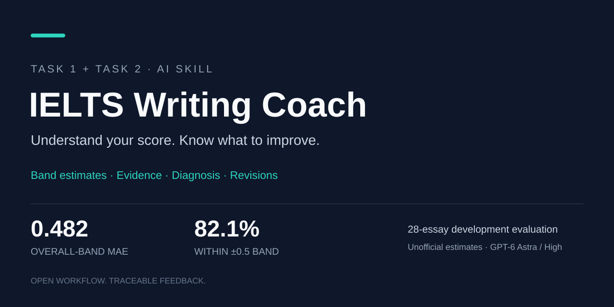

⭐ **觉得有帮助，欢迎给项目点个 [Star](https://github.com/Li2882/best-ielts-writing-skill)！** · If this helps, please star the project.

# IELTS Writing Correction for Academic Task 1 & 2

## 雅思大小作文批改 · Band Score Review · The best IELTS writing review Codex Skill

**四项估分、原文证据、错误诊断、修改建议。**

比大多数现有的雅思批改 Skill 更好。它面向 IELTS Academic Writing Task 1/Task 2：保留作文原文，分别评估 TA/TR、CC、LR、GRA，再用同任务锚点作文校准分数，给出可核对、可执行的反馈。



## What it does · 能做什么

- **Band score review**：四项分项估分、原始初评、锚点调整、最终模拟分。
- **Evidence-based correction**：引用原文定位真实错误，区分错误、档位限制和可选润色。
- **Task 1 / Task 2 feedback**：Task 1 核对原图与数据；Task 2 核对完整题目、观点和展开。
- **Actionable revision advice**：按提分影响排序，给出三个优先修改方向。
- **Traceable output**：列出实际读取的标准、提示词、锚点、缺项和校准状态。

## How it works · 工作方式

先由大模型分别评估四项，再读取同任务、同维度的锚点作文进行证据校准，最后输出可追溯的分数和修改建议。评分库、原始提示词和被引用校准证据已随仓库提供；下载后可直接在 Codex 中运行。

## Validation · 真实测试

28 篇开发回归（`gpt-6-astra`、`high`）：总分 MAE **0.482**，误差不超过 0.5 分的比例 **82.1%**。对照资料中的 quyen244 **0.857**、Gishguo **0.946** 是 7 篇、四项 MAE，与本版整体带分 MAE 不同，不作直接排名；完整方法、数据和限制见[研究过程](docs/research.md)。

## Start in Codex · 开始使用

1. 下载仓库并在 Codex 中打开**整个项目根目录**。
2. 使用 **GPT-6 Astra / High** 或更高推理档。
3. 输入：

```text
请使用 $ielts-writing-review-final 批改下面的 IELTS Academic 作文。
完整题目：……
Task 1 原图（如适用）：……
未经修改的作文原文：……
```

Task 1 必须提供原图或完整、已核实的数据；Task 2 必须提供完整题目。运行前可执行 `python scripts/check_ready.py` 检查评分依赖。详细说明见[使用指南](docs/usage.md)，完整批改示例见[真实示例](examples/review.md)。

本项目提供非官方模拟估分，不替代认证考官成绩；更换模型或推理档后，README 中的测试结果不自动继承。

## English

IELTS Academic Writing Correction and Band Score Review for Task 1 and Task 2. The skill provides four-criterion estimates, quoted evidence, error diagnosis, anchor calibration, and prioritized revision advice. Open the whole repository in Codex and invoke `$ielts-writing-review-final`. Recommended minimum: **GPT-6 Astra / High**.

Scoring rules, the reference library, and cited calibration evidence are included. Read the [usage guide](docs/usage.md), [real review](examples/review.md), and [research record](docs/research.md) before adapting the skill.
